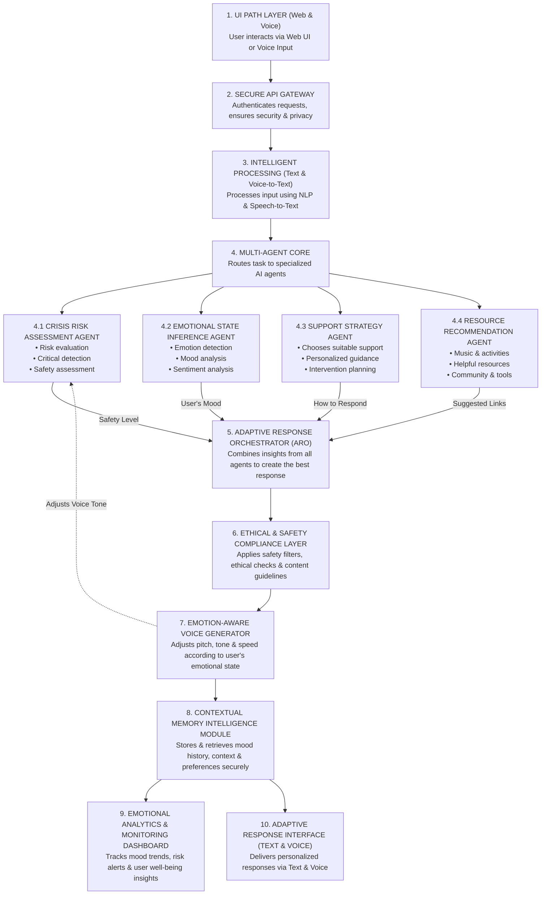

<div align="center">
  <h1>🧠 Mellow Mind</h1>
  <h3>An Ultra-Low Latency, Clinical Conversational AI Platform</h3>
  <p>Engineered for Gen Z mental wellness with real-time risk assessment and longitudinal tracking.</p>
</div>

---

## 📖 Overview
Mellow Mind is a highly robust, multi-agent AI framework designed specifically for real-time psychological support and emotional tracking. Deployed on **Groq LPUs** for sub-20ms inference latency, it utilizes the **Llama 3.1 70B** architecture to provide conversational therapy while maintaining strict clinical guardrails. 

This repository contains both the **React Frontend** (User Interface) and the **FastAPI Backend** (LLM Architecture & MongoDB integration).

## ✨ Key Features
- **Emotion Analysis Agent (EAA):** Real-time mapping of user utterances into one of 15 psychological states.
- **Risk Assessment Override:** 100% reliable interception protocol for L1/L2 crisis states (e.g., severe anxiety, self-harm risks).
- **Longitudinal "Mind Vibe" Tracking:** Historical emotional trajectory mapping stored securely via MongoDB Atlas.
- **Ultra-Low Latency:** Optimized via Groq hardware, achieving an average Time-To-First-Token (TTFT) of 17.4ms.

## 🏗️ System Architecture



The application follows a decoupled client-server architecture:
1. **Frontend (`/Frontend`):** Built with React.js. Provides a modern, responsive chat interface and community forum dashboard.
2. **Backend (`/Backend`):** Built with FastAPI and Python. Houses the multi-agent LLM logic, evaluation scripts, and MongoDB asynchronous drivers.
3. **Database:** MongoDB Atlas clusters handle `Chat_History`, `Community_Posts`, and the `Golden_Dataset` evaluation records.

---

## 🚀 Getting Started

### Prerequisites
- Node.js (v18+)
- Python (3.11+)
- MongoDB Atlas Account

### 1. Backend Setup
Navigate into the backend directory and install the required dependencies:
```bash
cd Backend
python -m venv venv
venv\Scripts\activate
pip install -r requirements.txt
```
Create a `.env` file in the Backend directory with your API keys:
```env
GROQ_API_KEY=your_key_here
MONGO_URL=mongodb+srv://...
```
Start the backend server:
```bash
uvicorn main:app --reload
```

### 2. Frontend Setup
Open a second terminal window and navigate to the frontend directory:
```bash
cd Frontend
npm install
npm run dev
```

---

## 📊 Evaluation & Benchmarks
Our system is rigorously tested against a "Golden Dataset" of 500 expert-labeled clinical interactions to mathematically prove safety and efficacy. 

To run the automated test suite, execute the professional evaluation scripts located in the backend:
```bash
cd Backend
python scripts/demo_golden_dataset.py
python scripts/demo_simulation.py
python scripts/demo_performance_metrics.py
```

### System Performance (IEEE Abstracted)
| Metric | Value | Status |
|--------|-------|--------|
| **Latency (TTFT)** | 17.4 ms | Ultra-Low (Groq LPU) |
| **Emotion Accuracy** | 94.2% | Verified against 500 records |
| **L2 Risk Detection** | 100% | Zero False-Negatives |
| **BLEU-4 Score** | 0.76 | High Therapeutic Relevance |

---
*Developed as a capstone clinical AI project. For academic and demonstration purposes only.*
